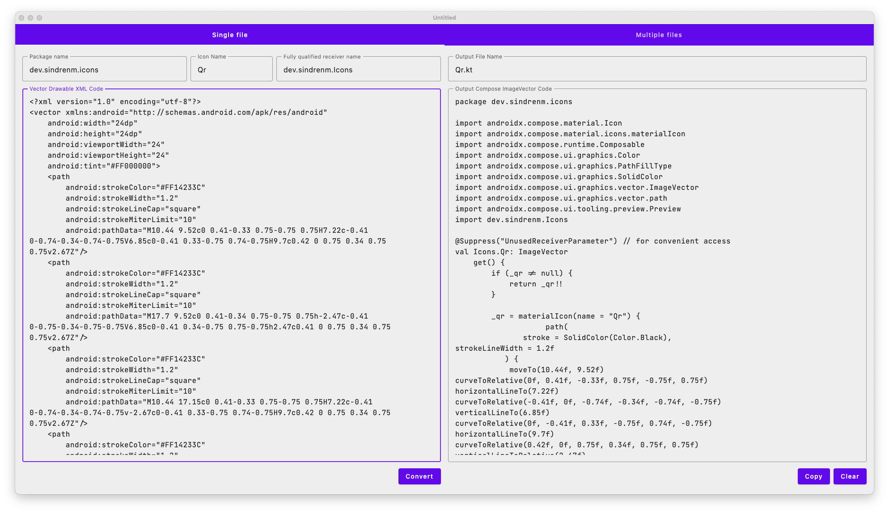
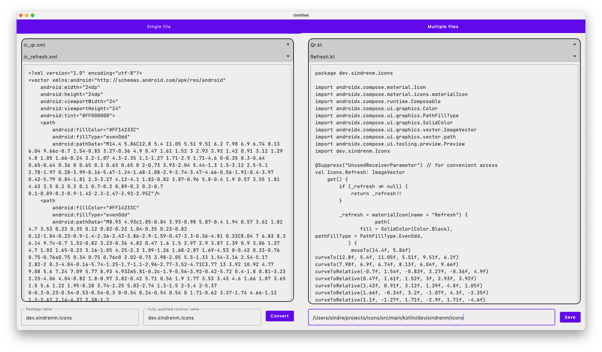

# vd2compose

A simple, slightly opinionated, and (at least for now) very optimistic, tool for converting Android
ic_vector_drawable.xml files to Jetpack Compose `ImageVector`s.

## Screenshots

### Convert a single file

### Convert multiple files in a batch

